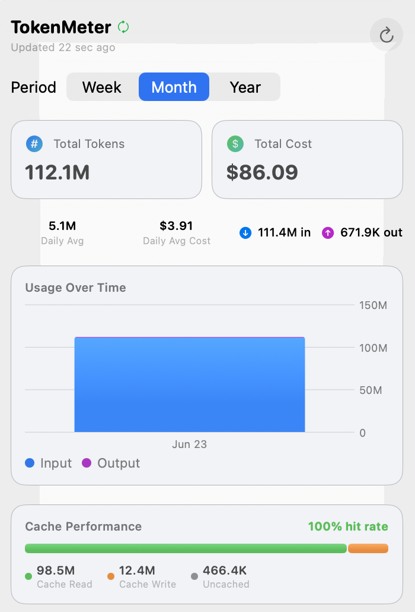
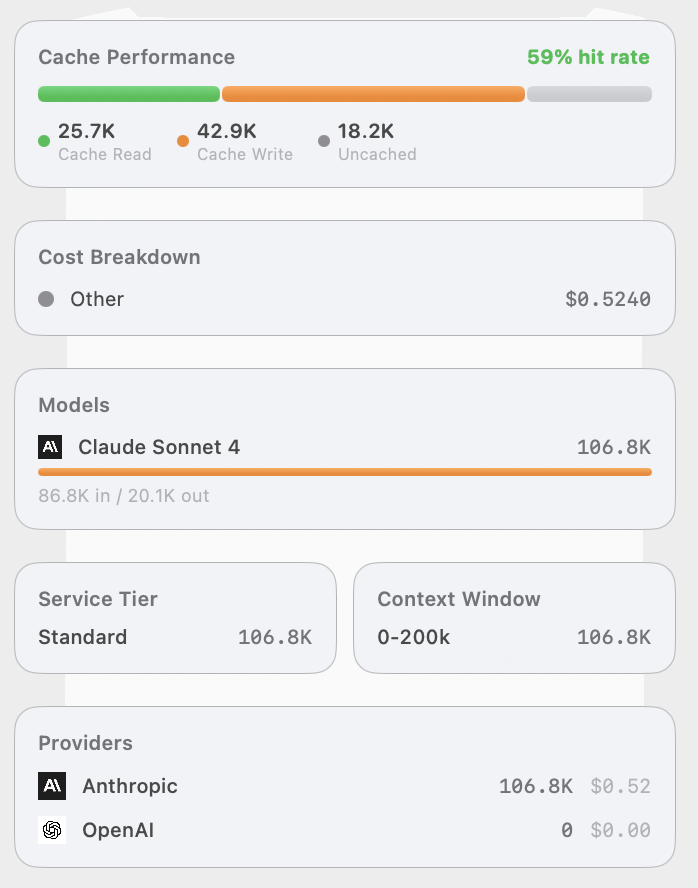

# TokenMeter

[](LICENSE)
[](https://www.apple.com/macos/)
[](https://swift.org)
[](https://developer.apple.com/xcode/)
[](https://developer.apple.com/documentation/swiftui)
[](#contributing)

A macOS menu bar app that displays your AI token usage — like a utility meter for your house, but for AI API consumption.

TokenMeter fetches usage data from AI provider APIs and displays aggregate and per-provider statistics in a compact dashboard accessible from your menu bar.

<p align="center">
  
  &nbsp;&nbsp;
  
</p>

## Supported Providers

| Provider | Status | API Used | Key Required |
|----------|--------|----------|--------------|
| Anthropic (Claude) | Supported | Admin API (`/v1/organizations/usage_report/messages`, `/v1/organizations/cost_report`) | Admin API key (`sk-ant-admin-...`) |
| OpenAI | Stub (planned) | Usage API (`/v1/organization/usage`) | Admin API key |

## Setup

1. Build and run the Xcode project
2. Click the gauge icon in the menu bar
3. Click the gear icon to open Settings
4. Enter your provider API key(s) and click Save
5. The dashboard loads automatically

### Getting an Anthropic Admin Key

1. Go to [platform.claude.com](https://platform.claude.com)
2. Navigate to **Settings → Admin Keys**
3. Click **Create Admin Key**
4. Copy the key (starts with `sk-ant-admin-...`)

> Note: Admin Keys require an organization account. If you have an individual account, go to Settings → Organization to set one up.

## Dashboard Sections

### Hero Cards

The two prominent cards at the top of the dashboard.

- **Total Tokens** — The sum of all input and output tokens consumed across all configured providers for the selected time period. This is your primary "meter reading."
- **Total Cost** — The dollar amount charged by the provider(s) for the selected period. Pulled from the provider's cost/billing API, so it reflects actual charges including any pricing tiers or discounts.

### Trend Badges

The row of small indicators below the hero cards.

- **vs prev period** — Percentage change in token usage compared to the equivalent previous period. For example, if you're viewing "This Week," it compares against last week. A green downward arrow means you used fewer tokens; orange upward means more.
- **Daily Avg** — Total tokens divided by the number of days in the selected period. Useful for spotting whether a monthly spike is sustained or a one-day anomaly.
- **Daily Avg Cost** — Same as above but for cost.
- **Input / Output** — Total input tokens (prompts you send) vs output tokens (responses you receive). Input is typically cheaper per token than output.

### Usage Over Time (Chart)

A stacked bar chart showing token consumption over the selected period.

- **Blue bars** — Input tokens (your prompts, context, cached content)
- **Purple bars** — Output tokens (model responses)
- **X-axis** — Daily buckets: weekday names (Mon, Tue, ...) for "Week," dates (Jan 5) for "Month" and "Year"
- **Y-axis** — Token count with K/M/B abbreviations

This chart helps you identify usage patterns — peak hours, heavy days, or gradual trends.

### Cache Performance

Shows how effectively prompt caching is being used. This is specific to Anthropic's prompt caching feature, where repeated context (like system prompts or large documents) can be cached to reduce costs.

- **Hit Rate** — The percentage of input tokens that were served from cache rather than re-processed. Higher is better — cached tokens are significantly cheaper.
- **Cache Read (green)** — Tokens served from cache. These are billed at a reduced rate.
- **Cache Write (orange)** — Tokens written to cache for future use. There's a one-time cost to create the cache, but subsequent reads are cheaper.
- **Uncached (gray)** — Tokens processed normally without caching.

The colored bar provides a visual ratio of these three categories. If you see mostly gray, you may benefit from enabling prompt caching in your API calls.

### Cost Breakdown

Breaks down your total cost by charge type.

- **Tokens** — The cost of input and output token processing. This is the primary cost for most users.
- **Web Search** — Cost of web search tool usage, if any (Anthropic charges per search request).
- **Code Execution** — Cost of code execution tool usage, if any.

### Models

Lists every model you've used in the selected period, sorted by total token consumption.

Each model row shows:
- **Provider icon** — Which provider the model belongs to (useful when multiple providers are configured)
- **Model name** — e.g., "Claude Sonnet 4"
- **Total tokens** — Combined input + output for this model
- **Usage bar** — Visual proportion of this model's usage relative to your total
- **Input / Output split** — How many tokens were input vs output for this specific model
- **Per-model cost** — Dollar amount attributed to this model (when available from the cost API)

### Service Tier

Shows usage split by the service tier used for API requests. This section appears when the data includes tier information.

- **Standard** — Normal API requests
- **Batch** — Batch API requests (cheaper, higher latency)
- **Priority** — Priority tier requests (guaranteed capacity)
- **Flex** — Flex tier requests (discounted, best-effort)

### Context Window

Shows usage split by context window size. Larger context windows may have different pricing.

- **0-200k** — Requests using up to 200K token context
- **200k-1M** — Requests using the extended 200K-1M token context window

### Provider Breakdown

Only appears when multiple providers are configured. Shows total tokens and cost per provider, so you can compare your usage across services.

## Time Period Selector

A segmented control at the top of the dashboard switches the entire view between three periods, each starting from the most recent calendar boundary up to now:

- **Week** — Since the start of the current week (the default)
- **Month** — Since the first of the current month
- **Year** — Since January 1 of the current year

## Settings

Open Settings from the gear icon. In addition to provider API keys, two preferences are available (persisted in UserDefaults):

### Auto-refresh

Automatically re-fetches usage on a timer. When enabled, you can pick an interval: 1 min, 5 min, 15 min, 30 min, or 1 hour.

### Budget notifications

Sends a macOS notification as you approach a spending limit. You can set a **daily budget** (checked against the Week period) and a **monthly budget** (checked against the Month period). Alerts fire at 80% and at 100% of each budget.

## Architecture

```
TokenMeter/
├── TokenMeterApp.swift          — App entry point, menu bar + settings window
├── ContentView.swift            — Root view, switches between setup and dashboard
├── Models/
│   └── UsageModels.swift        — Provider protocol, shared display models
├── Services/
│   ├── KeychainService.swift    — Secure API key storage via macOS Keychain
│   ├── AnthropicService.swift   — Anthropic Admin API integration
│   └── OpenAIService.swift      — OpenAI provider (stub)
├── ViewModels/
│   └── DashboardViewModel.swift — Fetches from all providers, aggregates data
└── Views/
    ├── DashboardView.swift      — Main usage dashboard UI
    └── SettingsView.swift       — API key configuration per provider
```

### Adding a New Provider

1. Add a case to `ProviderType` in `UsageModels.swift`
2. Create a new service file (e.g., `GeminiService.swift`) implementing the `UsageProvider` protocol
3. Add an instance to the `providers` array in `DashboardViewModel`
4. The settings view and dashboard automatically pick up the new provider

### Key Design Decisions

- **MVVM architecture** — ViewModels own business logic, Views are declarative, Services handle API calls
- **Protocol-based providers** — `UsageProvider` protocol makes adding new AI services straightforward
- **Keychain storage** — API keys are stored in the macOS Keychain, not in UserDefaults or plain files
- **Parallel fetching** — All configured providers are fetched concurrently using Swift's structured concurrency
- **Trend comparison** — Fetches the previous equivalent period to calculate % change

## Requirements

- macOS 26.2+
- Xcode 26 (Swift 5)
- An Anthropic organization account with Admin API access (for Anthropic provider)

## Contributing

Contributions are welcome. Whether it's a new provider, a bug fix, or a UI improvement, here's how to get started.

### Getting started

1. Fork the repository and clone your fork
2. Open `TokenMeter.xcodeproj` in Xcode 26
3. Build and run with `Cmd+R` (or `xcodebuild -project TokenMeter.xcodeproj -scheme TokenMeter build`)

### Ways to contribute

- **Add a provider** — Implementing a new AI provider (OpenAI, Gemini, etc.) is the most impactful contribution. See [Adding a New Provider](#adding-a-new-provider) for the steps.
- **Fix a bug** — Check the [issues](https://github.com/emrahu/TokenMeter/issues) for anything open, or open a new issue describing what you found.
- **Improve the dashboard** — New charts, breakdowns, or polish to the existing views.

### Workflow

1. Create a feature branch off `main` (e.g. `git checkout -b add-gemini-provider`)
2. Make your change, keeping it focused on a single concern
3. Follow the existing conventions: MVVM, protocol-based providers, `@MainActor` on view models, and keep provider-specific models behind the service boundary
4. Build cleanly with no new warnings, and run the app to confirm the change works
5. Open a pull request against `main` with a clear description of what changed and why

### Guidelines

- Never commit API keys, secrets, or `.xcuserdata` — keys belong in the Keychain, not in source
- Keep money handling in `Double` dollars (convert at the service boundary)
- Match the surrounding code style rather than introducing new patterns

If you're planning a larger change, open an issue first so we can discuss the approach.

## License

This project is licensed under the MIT License. See the [LICENSE](LICENSE) file for details.
